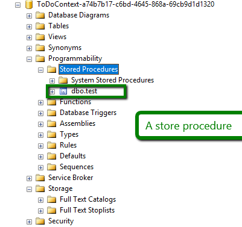

# Store Procedure (sprocs)

### What is sprocs
sprocs is stored in db. And it is simply a procedure. Actually a collection of sql instructions.


### How to write a sprocs
```sql
CREATE PROCEDURE test
(@ID varchar(10))
AS 
SELECT Title FROM ToDoItem WHERE ID = @ID
GO
```

### Calling a sproc
```sql
test 1
```

### To see a database store procedures by SQL Management Studio



### Calling a procedure from asp.net core
Reference : [storeprocedure workaround for asp.net core](https://forums.asp.net/t/2098192.aspx?How+to+call+a+stored+procedure+from+ASP+net+core)
